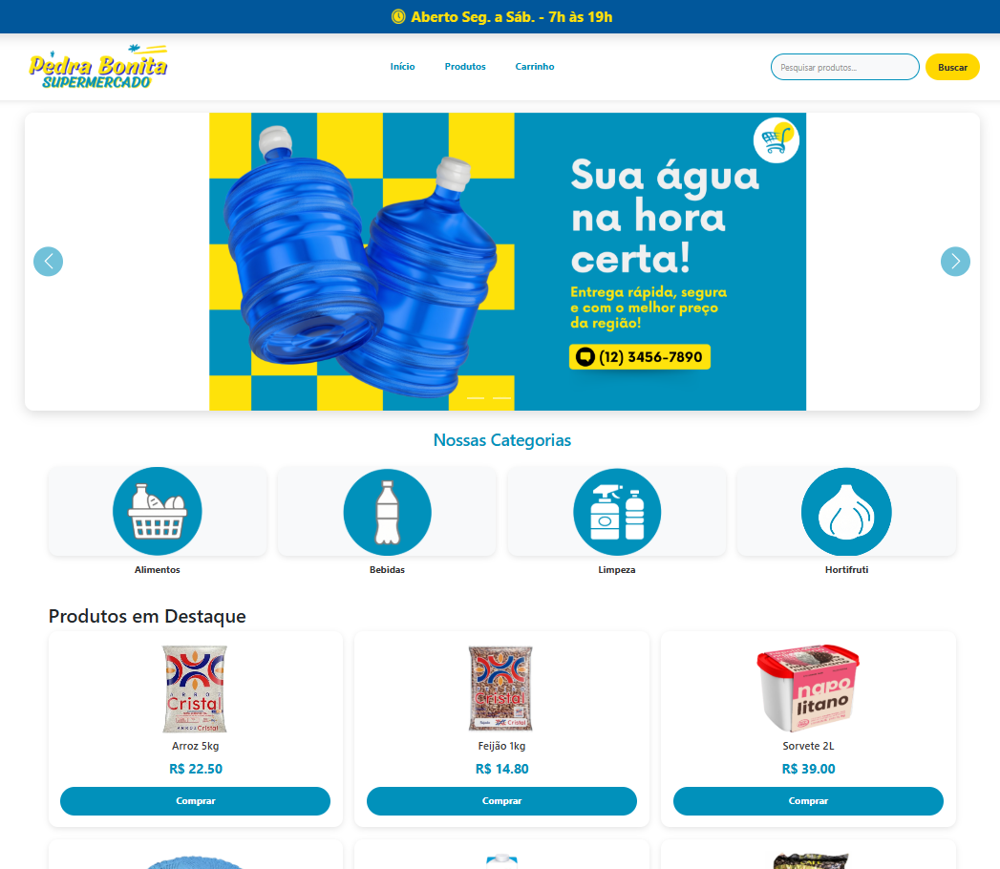
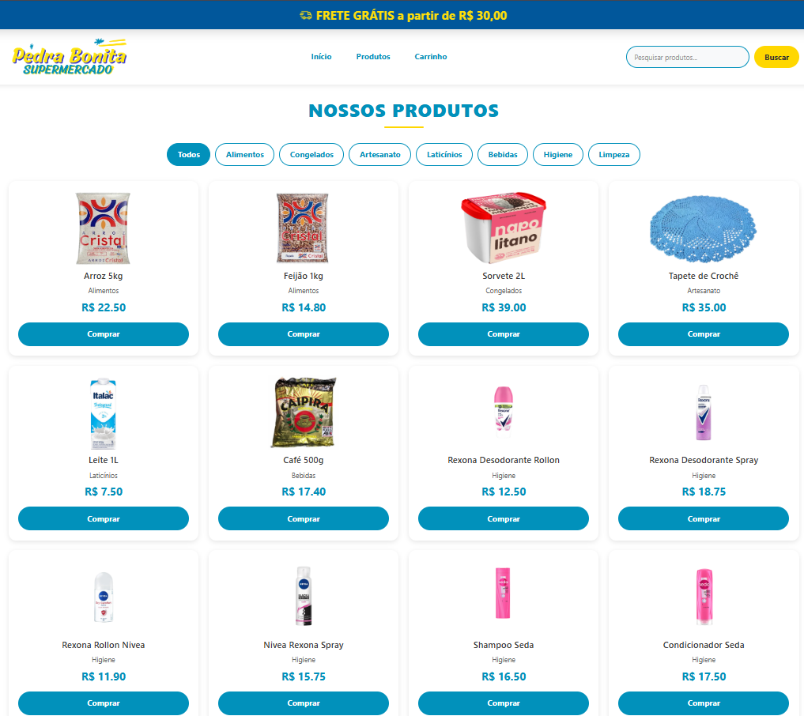
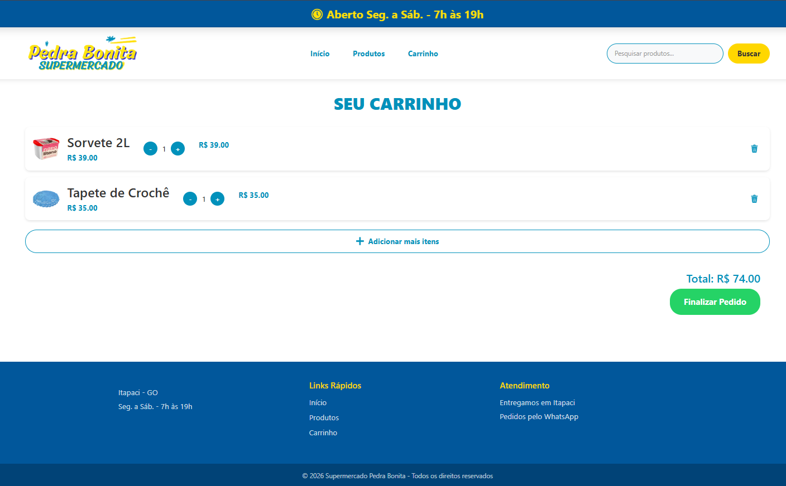
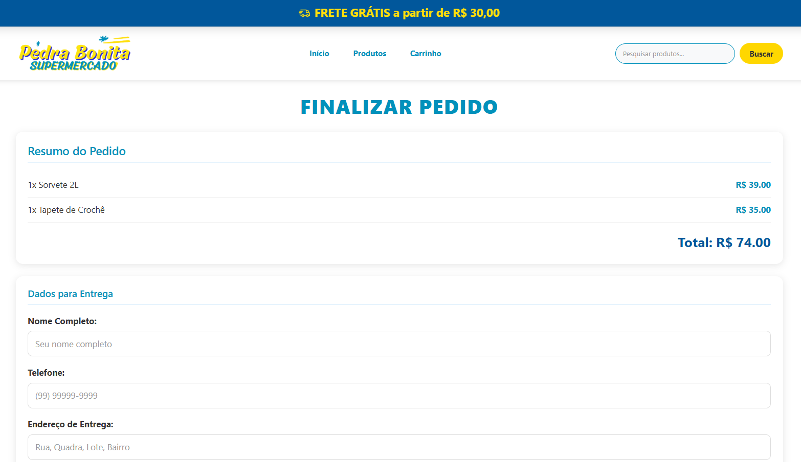

# Supermercado Pedra Bonita - Pedidos Online

> **Status do Projeto:** MVP Concluído 
> 
> Sistema de pedidos online desenvolvido para o Supermercado Pedra Bonita, um negócio familiar em Itapaci-GO.


---

## 📋 Sobre o Projeto

Sistema web de pedidos online desenvolvido para o **Supermercado Pedra Bonita**, permitindo que clientes naveguem por produtos, montem carrinho e finalizem pedidos diretamente pelo WhatsApp.

---

## Screenshots

### Página Inicial


### Catálogo de Produtos


### Carrinho de Compras


### Finalizar Pedido


---

## Funcionalidades

- Carrossel de banners promocionais
- Categorias de produtos clicáveis
- Busca de produtos (ignora acentos)
- Carrinho de compras completo
- Controle de quantidade (+/-)
- Excluir itens
- Página de checkout
- Finalização via WhatsApp
- Design responsivo (adaptável a celular e computador)

---

## Tecnologias

| Backend | Frontend | Banco |
|---------|----------|-------|
| Python 3.11 | HTML5 | SQLite |
| Flask 3.0 | CSS3 | SQLAlchemy |
| | Bootstrap 5 | |

---

## Instalação

```bash
# 1. Clone
git clone https://github.com/SEU_USUARIO/supermercado-pedra-bonita.git

# 2. Entre na pasta
cd supermercado-pedra-bonita

# 3. Ambiente virtual
python -m venv venv
venv\Scripts\activate

# 4. Instale
pip install -r requirements.txt

# 5. Rode
python main.py
